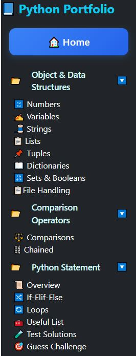
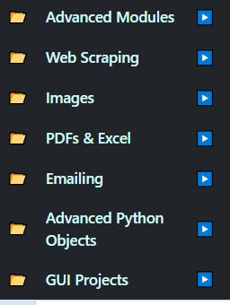

# 🧠 Python Django Portfolio Project

Welcome to **Aminul Islam's Professional Python & Django Portfolio**.  
This project showcases interactive examples, quizzes, and real-world use cases across core Python and Django concepts — all designed for learning, demonstrating mastery, and impressing potential employers and clients.

---

## 📸 Screenshots

| Sidebar Menu | Sidebar Pages | Interactive Pages |
|--------------|---------------|-------------------|
|  |  |  |
|  |  |  |
|  |  |  |

---

## 🛠 Technologies Used

- **Python 3**
- **Django 4**
- HTML5, CSS3, Bootstrap 5
- JavaScript (Quiz logic)
- Git & GitHub

---

## 📁 Features

✅ Real-world Python Examples  
✅ Interactive Quizzes with Sound Feedback  
✅ Comment Forms under Each Code Block  
✅ Sidebar Navigation with Active Link Highlight  
✅ Bootstrap Tabs for Content Separation  
✅ Clean and Professional Layout

---

## 🧪 Project Structure

```bash
python-portfolio/
├── python_portfolio/
│   ├── core/
│   ├── static/
│   ├── templates/
│   ├── ...
│   └── views.py, urls.py, etc.
├── images/
│   └── [screenshots & certificates]
├── manage.py
├── requirements.txt
└── README.md
