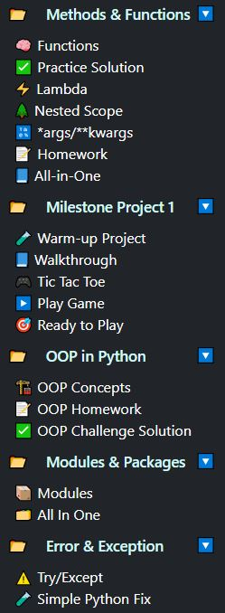
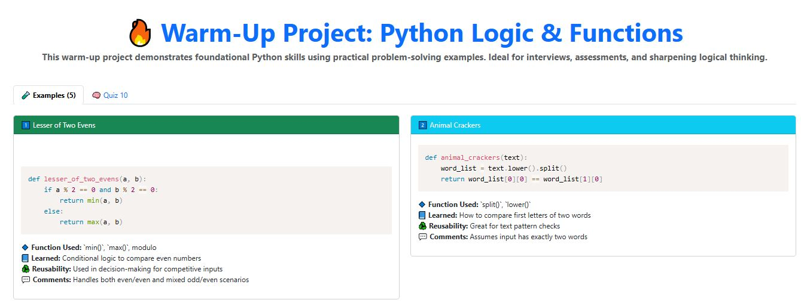
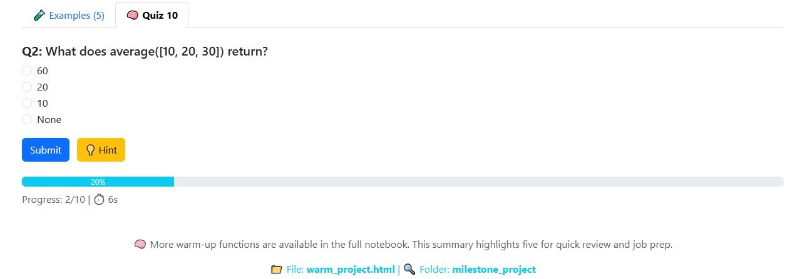
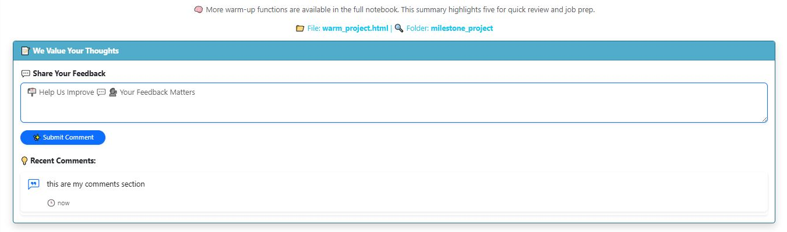
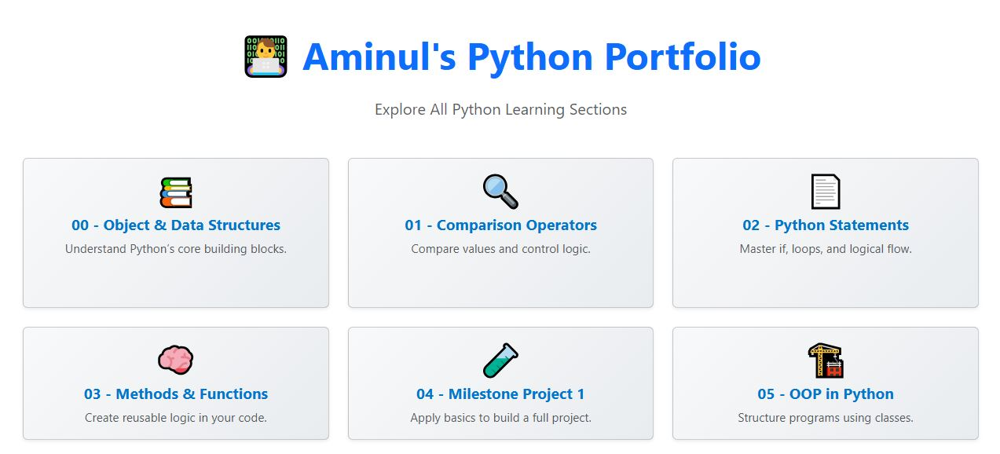
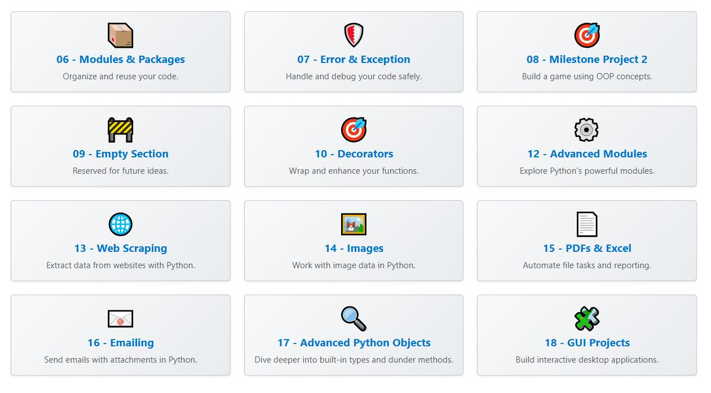
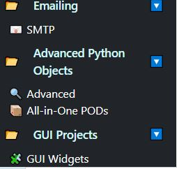
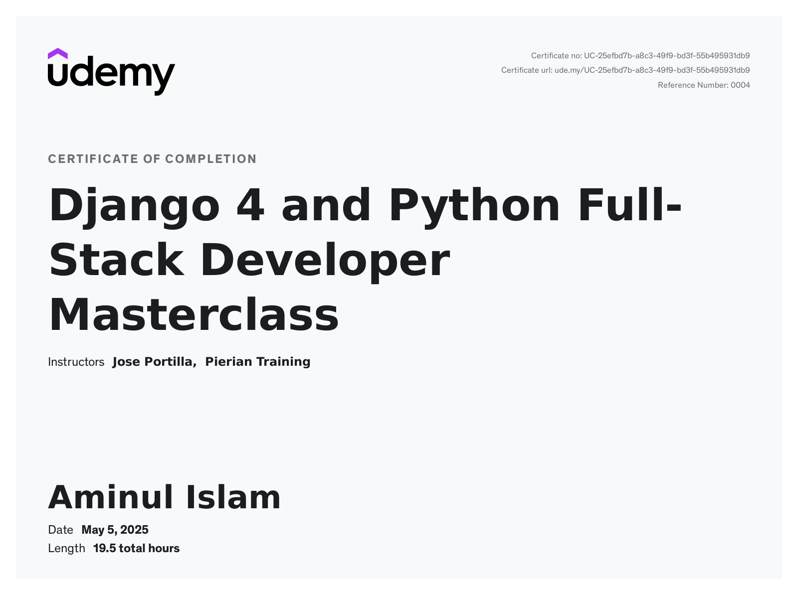

# 🧠 Python Django Portfolio Project

Welcome to **Aminul Islam's Professional Python & Django Portfolio**.

This portfolio showcases interactive examples, quizzes, and practical real-world projects using Django and Python. It is designed to highlight clean code practices, educational UI/UX, and mastery of full-stack concepts — ideal for job seekers, students, and professionals.

---

## 📸 Screenshots

| Sidebar Navigation                                     | Content Pages | Interactive Views                       |
|--------------------------------------------------------|---------------|-----------------------------------------|
|  |  |     |
|               |  |    |
|                    |  |  |

---

## 📜 Certifications

| Python Certificate | Django Certificate |
|--------------------|--------------------|
|  |  |

---

## 🚀 Key Features

- ✅ Real-world Python examples with explanations  
- ✅ Interactive quizzes powered by JavaScript  
- ✅ Comment submission interface under examples  
- ✅ Responsive design with Bootstrap 5  
- ✅ Sidebar navigation with collapsible folders  
- ✅ Clean, modular Django project structure

---

## 🛠️ Tech Stack

- **Backend:** Python 3, Django 4  
- **Frontend:** HTML5, CSS3, Bootstrap 5  
- **Logic:** JavaScript (Quiz logic)  
- **Version Control:** Git & GitHub  
- **IDE:** PyCharm

---

## 🧪 Project Structure

```bash
python-portfolio/
├── python_portfolio/
│   ├── core/
│   ├── static/
│   ├── templates/
│   ├── views.py, urls.py, ...
├── images/
│   ├── *.jpg  # Screenshots & certificates
├── manage.py
├── requirements.txt
└── README.md
